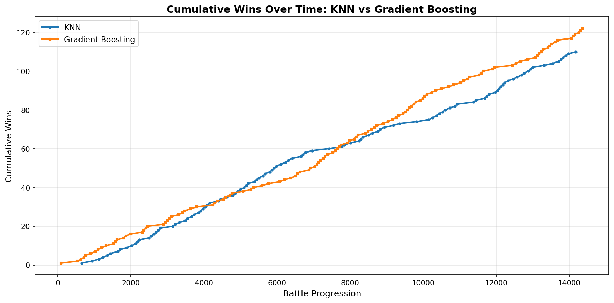

# showdown_warrior

showdown_warrior is a framework for exploring how different machine learning methods can learn to play Pokemon Showdown using a low-dimensional approximation of battle state.

## Motivation

Pokemon battles have complex, high-dimensional state spaces. Traditional deep learning approaches would encode this full state, including perhaps history, and learn end-to-end.

This project takes a different approach: we hand-craft a small set of features that capture the essence of a (gen 1) battle decision, intentionally leaving out subtleties, then compare how various ML methods learn from this compressed representation, and what bits of strategy they are able to pick up. The current feature set includes:

- `self_hp` / `opp_hp` - HP fractions
- `outspeed_prob` - probability of moving first
- `is_status_move` - status effect probability
- `exp_damage_done` / `exp_damage_received` - expected damage exchange

This low-dimensional approach lets us:
- Train quickly with limited data
- Compare classical ML methods (KNN, gradient boosting, etc.) directly
- Understand what the model is learning

In the future, this could be extended to methods that work in high dimensions, taking a more traditional deep learning approach with raw state encoding.

## Available ML Methods

- `knn` - K-Nearest Neighbors (default)
- `gb` - Gradient Boosting

Select via the `--method` flag.

## Setup

1. Clone this repository and cd into it

2. Save Showdown credentials in `./data/login.txt`:
   ```
   username
   password
   ```

3. Install dependencies:
   ```bash
   uv sync
   ```

4. Run the bot:
   ```bash
   uv run python start_warrior.py
   ```

## Continuous Training

For self-play training that accumulates data across battles:

```bash
# Both bots use KNN (default)
./continuous_battles.sh

# Bot 1 uses gradient boosting, bot 2 uses KNN
./continuous_battles.sh gb knn
```

This runs battles in tmux, combining training data between rounds. It assumes you also have pokemon-showdown itself saved in the parent directory of this directory.

## Project Structure

- `start_warrior.py` - Entry point
- `warrior_player.py` - Battle lifecycle and action selection
- `thinkers/` - ML method implementations
  - `feature_engineering.py` - Shared feature calculations
  - `knn_thinker.py` - KNN implementation
  - `gb_thinker.py` - Gradient boosting implementation
- `continuous_battles.sh` - Self-play training script

## TODO

Critical hit modeling (speed-based crit rates in Gen 1) is not implemented.

I would like integration testing to be easier than just running a continuous battle for a while. We should test both training and self-driving modes automatically, with a repeatable seed, and have unit tests, especially for the engineered features.

I would also like to analyze what types of tactics the bots can learn from the condensed feature set, in addition to just tracking win rate for different models. I expect the bots to at least be able to learn that going for the KO when available is usually a good strategy, as well as avoiding known immediate KO risks. I expect GB to be able to learn this more quickly (see below).

## Ethics

This bot is intended for testing and research. Do not use it to challenge random players on the official Pokemon Showdown server. For large-scale training or continuous testing, host your own Showdown instance.

## Analysis

The following graph shows cumulative wins over time for the KNN and Gradient Boosting methods over time, playing against each other. It suggests that GB might have gained a slight edge over KNN on the limited feature set, but more data is needed to conclude that it has truly pulled away.



## License

MIT License
